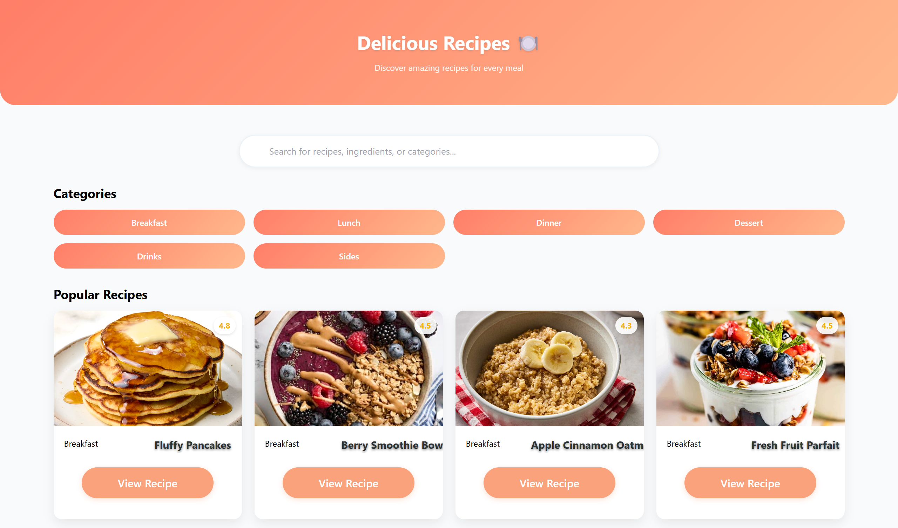
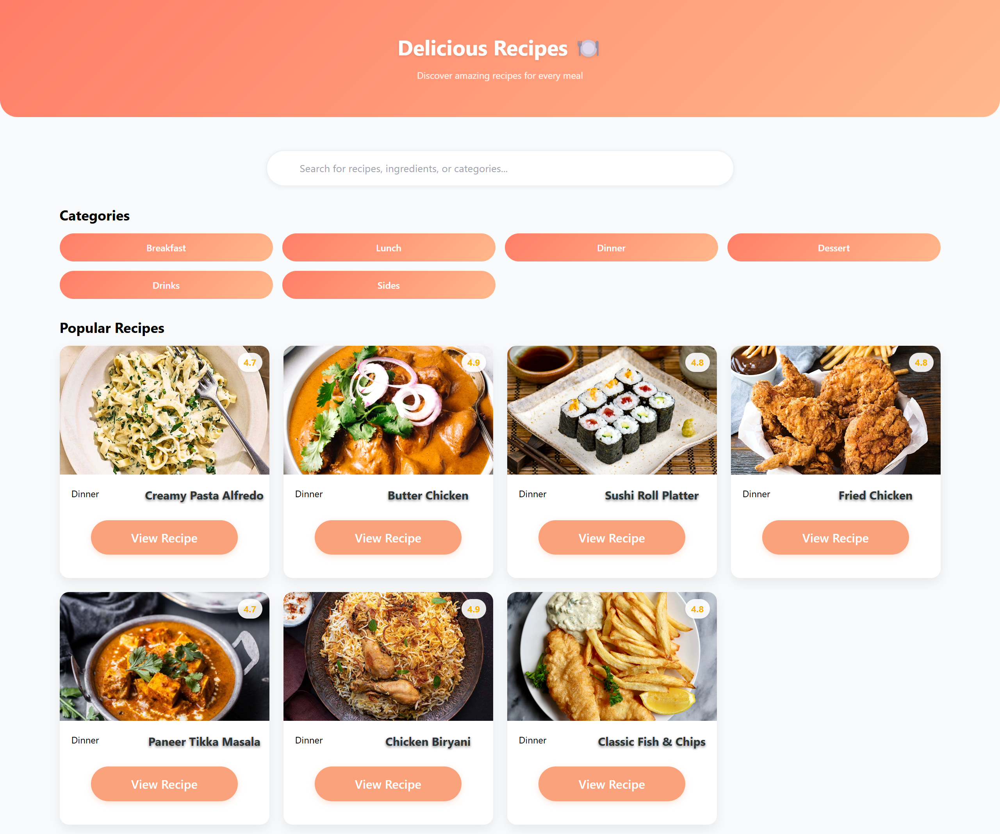
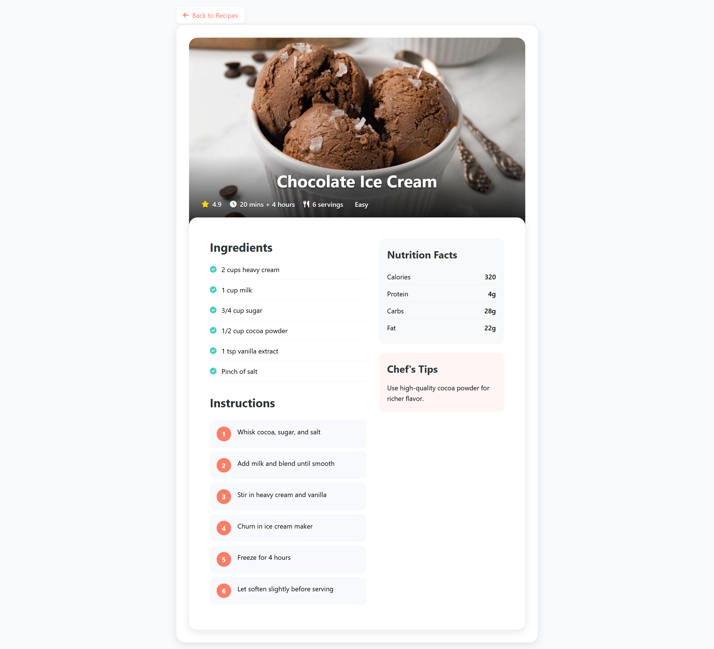

# Delicious Recipes App 🍳

A modern web application for discovering and exploring delicious recipes across various categories including breakfast, lunch, dinner, desserts, drinks, and sides.

## Screenshots

### Homepage

*Homepage featuring search functionality and recipe categories*

### Recipe Categories

*Browse recipes by different meal categories*

### Recipe Details

*Detailed view of a recipe showing ingredients, instructions, and nutritional information*

## Features

- 🔍 Search functionality for recipes and ingredients
- 📑 Categorized recipe collections
- 📝 Detailed recipe instructions
- 🥗 Nutritional information
- 👨‍🍳 Chef's tips
- ⏲️ Cooking time and servings information
- 📱 Responsive design

## Categories Available

- Breakfast
- Lunch
- Dinner
- Dessert
- Drinks
- Sides

## Popular Dishes

The application features various popular dishes including:
- Creamy Pasta Alfredo
- Butter Chicken
- Sushi Roll Platter
- Fried Chicken
- Paneer Tikka Masala
- Chicken Biryani
- Classic Fish & Chips
